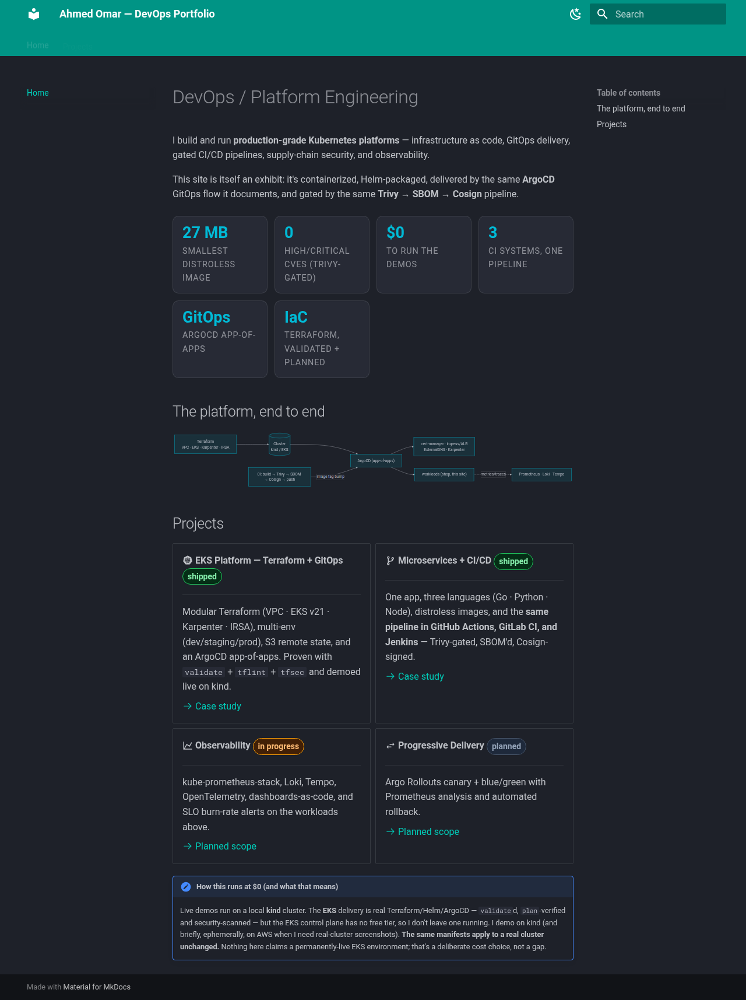

# portfolio-site — DevOps portfolio, shipped like one

A static portfolio site (**MkDocs Material**) that documents the platform work — and is
itself delivered by that same machinery: containerized on **distroless/static**, gated by
**Trivy → SBOM → Cosign**, packaged with **Helm**, and deployed via **ArgoCD**.

> Project 5 (the front door) of a platform series:
> eks-platform · polyglot-microservices · k8s-observability · progressive-delivery · **this site**.



## Three delivery paths (in code)

| Path | Where | Status |
|---|---|---|
| **kind** | Helm + ingress-nginx on a local cluster | live demo ($0) |
| **EKS** | same chart (`values-eks.yaml`), ALB + ACM, ArgoCD app targeting the eks-platform cluster | code + `helm template`-verified; applied only ephemerally |
| **S3 + CloudFront** | Terraform (`terraform/`), Route53 + ACM TLS | free-tier public finale — `validate` + `tfsec`-clean, applied at launch |

Nothing here claims a permanently-live cloud deployment; that's a deliberate cost choice.

## Quickstart

```bash
make serve       # live preview at http://localhost:8000 (mkdocs)
make image       # build the distroless/static container image
make scan        # Trivy gate (fixable HIGH/CRITICAL) on the image
make helm-lint   # lint + render the chart for kind and EKS
make tf-check    # terraform fmt/validate + tfsec (no AWS creds)
make dev         # build -> kind load -> helm install (isolated kubeconfig)
```

## The container

A ~30-line **Go static server** (stdlib only) on `gcr.io/distroless/static:nonroot` —
non-root (uid 65532), read-only rootfs, all caps dropped. **~18 MB, 0 CVEs.** Same hardened
base as the `catalog` service in the microservices project.

## Layout

```
docs/                     # Markdown case studies (the site content) + assets/
server/                   # tiny Go static file server
Dockerfile                # mkdocs build -> distroless/static
deploy/helm/site/         # chart + values-{kind,eks}.yaml
deploy/argocd/            # Application manifests (kind + EKS)
terraform/                # S3 + CloudFront + Route53 (Phase B)
.github/workflows/ci.yaml # docs -> image (trivy/sbom/cosign) -> helm -> gitops bump
```

## License

[MIT](LICENSE)
