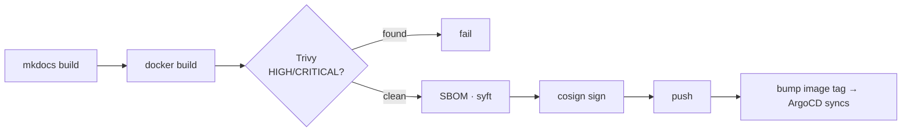

# How this site ships

This page is the point: the site isn't a hand-uploaded HTML file — it rides the **same
DevOps machinery** it documents.

## Build

- Content is **Markdown** (MkDocs Material). `mkdocs build` produces static HTML.
- It's served by a tiny **Go static server on `distroless/static`** — non-root (uid 65532),
  read-only rootfs, zero third-party dependencies (the same hardened base as the `catalog`
  service), so the image scans **0 CVEs**.

## Ship (identical to the microservices project)

## Run — three delivery paths, in code

| Path | Where | Status |
|---|---|---|
| **kind** | Helm + ingress-nginx on a local cluster | live demo ($0) |
| **EKS** | same Helm chart (`values-eks.yaml`), ALB + ACM, ArgoCD `Application` targeting the eks-platform cluster | code + `helm template`-verified; applied only ephemerally |
| **S3 + CloudFront** | Terraform-managed static hosting (`terraform/`), Route53 + ACM TLS | the free-tier public finale — Terraform written, `plan`-verified |

!!! note "Truth in labeling"
    The kind path is what you see running in screenshots. The EKS and S3/CloudFront paths are
    real, validated code that I apply on demand — I don't keep paid infrastructure running just
    to look busy. When the public S3/CloudFront finale is live, its URL will appear here.

## Why serve a docs site through Kubernetes at all?

Because the medium *is* the message: a DevOps portfolio should demonstrate delivery, not just
describe it. The site is another tile in the ArgoCD app-of-apps, gated by the same pipeline as
every other workload.
