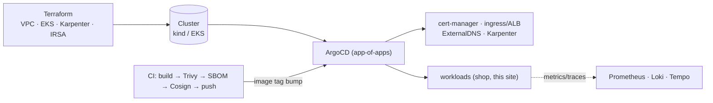

# DevOps / Platform Engineering

I build and run **production-grade Kubernetes platforms** — infrastructure as code,
GitOps delivery, gated CI/CD pipelines, supply-chain security, and observability.

This site is itself an exhibit: it's containerized, Helm-packaged, delivered by the same
**ArgoCD** GitOps flow it documents, and gated by the same **Trivy → SBOM → Cosign** pipeline.

27 MB

smallest distroless image

0

HIGH/CRITICAL CVEs (Trivy-gated)

$0

to run the demos

3

CI systems, one pipeline

GitOps

ArgoCD app-of-apps

IaC

Terraform, validated + planned

## The platform, end to end

## Projects

-   :material-kubernetes: **EKS Platform — Terraform + GitOps** shipped

    ---

    Modular Terraform (VPC · EKS v21 · Karpenter · IRSA), multi-env (dev/staging/prod),
    S3 remote state, and an ArgoCD app-of-apps. Proven with `validate` + `tflint` + `tfsec`
    and demoed live on kind.

    [:octicons-arrow-right-24: Case study](projects/eks-platform.md)

-   :material-source-branch: **Microservices + CI/CD** shipped

    ---

    One app, three languages (Go · Python · Node), distroless images, and the **same
    pipeline in GitHub Actions, GitLab CI, and Jenkins** — Trivy-gated, SBOM'd, Cosign-signed.

    [:octicons-arrow-right-24: Case study](projects/microservices.md)

-   :material-chart-line: **Observability** in progress

    ---

    kube-prometheus-stack, Loki, Tempo, OpenTelemetry, dashboards-as-code, and SLO
    burn-rate alerts on the workloads above.

    [:octicons-arrow-right-24: Planned scope](projects/observability.md)

-   :material-swap-horizontal: **Progressive Delivery** planned

    ---

    Argo Rollouts canary + blue/green with Prometheus analysis and automated rollback.

    [:octicons-arrow-right-24: Planned scope](projects/progressive-delivery.md)

!!! note "How this runs at $0 (and what that means)"
    Live demos run on a local **kind** cluster. The **EKS** delivery is real
    Terraform/Helm/ArgoCD — `validate`d, `plan`-verified and security-scanned — but the EKS
    control plane has no free tier, so I don't leave one running. I demo on kind (and briefly,
    ephemerally, on AWS when I need real-cluster screenshots). **The same manifests apply to a
    real cluster unchanged.** Nothing here claims a permanently-live EKS environment; that's a
    deliberate cost choice, not a gap.
