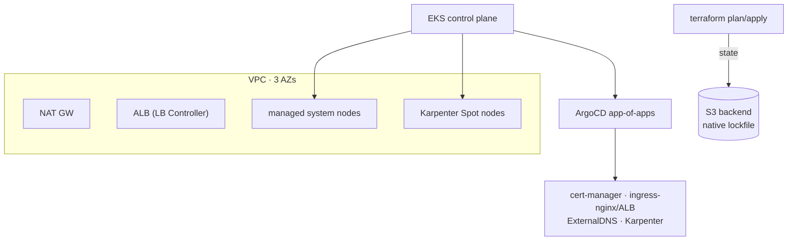
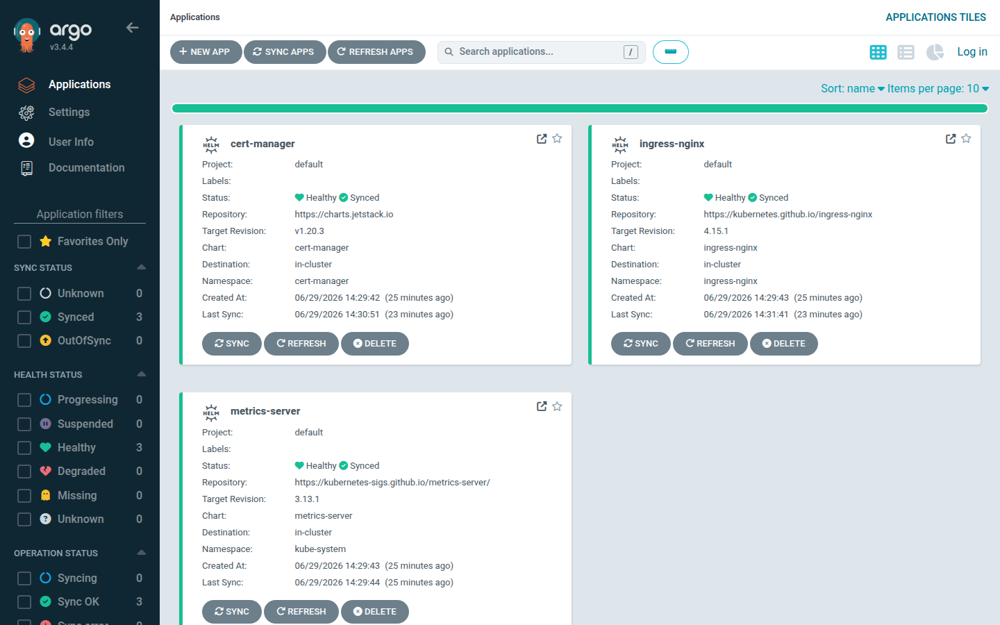
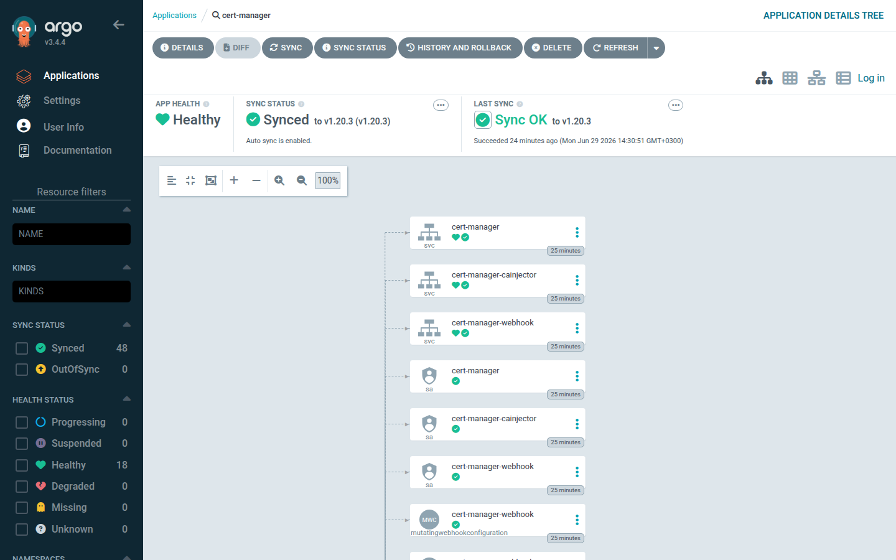

# EKS Platform — Terraform + GitOps

shipped · Terraform · EKS v21 · Karpenter · ArgoCD

## Problem

Small/mid clients repeatedly need the same foundation: a modular, multi-environment EKS
platform with autoscaling, ingress, DNS, TLS and GitOps — reproducible from scratch and
cheap to run. This project is that foundation.

## Architecture

## Key decisions

| Decision | Choice | Why |
|---|---|---|
| Node autoscaling | **Karpenter** (Spot-first) | faster + better bin-packing than Cluster Autoscaler |
| Remote state lock | **S3 native lockfile** | Terraform 1.10+, no DynamoDB table to run |
| Multi-env | **state per env** + one composition module | clear blast-radius isolation, DRY |
| Addons | **GitOps-first** via ArgoCD | Terraform builds the cloud, ArgoCD runs the cluster |
| IAM | **IRSA + Pod Identity** | least-privilege per workload |

## Evidence

The app-of-apps reconciled live on a kind cluster — every Application **Synced / Healthy**:

Drilling into one addon's live resource tree (auto-sync on):

## What runs where (honest split)

- **Live on kind ($0):** ArgoCD, cert-manager, ingress-nginx, metrics-server — the GitOps
  platform, proven end to end (screenshots above).
- **EKS-specific, as code + `plan` + `tfsec`:** the EKS control plane, Karpenter, AWS Load
  Balancer Controller, ExternalDNS, IRSA. EKS has no free tier, so these are validated and
  plan-verified rather than left running. **The same manifests apply to a real cluster
  unchanged.**

## Quality gates (all green, $0)

`terraform fmt` · `validate` (dev/staging/prod) · `tflint` (+AWS ruleset) · `tfsec` — run in CI
with no cloud credentials.

[:octicons-mark-github-16: Repo: eks-platform](https://github.com/aomar97/eks-platform){ .md-button }
