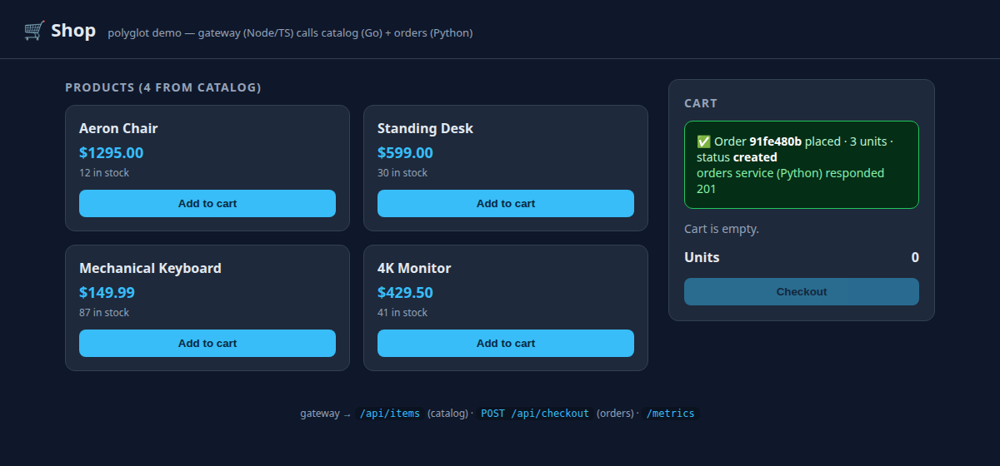

# Microservices + CI/CD

<span class="pill done">shipped</span> · Go · Python · Node/TS · Distroless · Trivy · Cosign

## Problem

Prove a container delivery pipeline that's **language-agnostic** and **supply-chain gated**,
and show it's portable across CI systems — the comparison clients actually ask for.

## The app (a vehicle, intentionally trivial)

A small "shop": a Node/TS **gateway** calls a Go **catalog** and a Python **orders** service.
The app is deliberately simple — the interesting part is how it's built, secured and shipped.

| Products from `catalog`, cart populated | Checkout → order created by `orders` |
|:---:|:---:|
|  |  |

## Pipeline (identical in 3 CI systems)

```
lint + test → build → Trivy scan (gate) → SBOM (syft) → Cosign sign → push → GitOps bump
```

| | GitHub Actions | GitLab CI | Jenkins |
|---|---|---|---|
| Config | YAML, job-centric | YAML, stage-centric | Groovy (declarative) |
| Fan-out | `strategy.matrix` | `parallel:matrix` | `parallel` + `matrix` |
| Signing | OIDC `id-token` | `id_tokens` SIGSTORE | plugin/OIDC |
| Best fit | GitHub-native | all-in-one GitLab | on-prem / k8s agents |

## Supply chain (every image, every pipeline)

- **Trivy** fails the build on fixable HIGH/CRITICAL vulns.
- **Syft** emits an SPDX SBOM artifact.
- **Cosign** keyless-signs the pushed image (OIDC, no long-lived keys).

## Images (distroless, non-root, read-only rootfs)

| Service | Language | Image | Size |
|---|---|---|---|
| catalog | Go | distroless/static | ~27 MB |
| orders | Python | distroless/python3 | ~118 MB |
| gateway | Node/TS | distroless/nodejs | ~216 MB |

## What it proves

Polyglot delivery, minimal attack surface, enforced supply-chain gates, per-env Helm, and
that the delivery *shape* is portable across CI tooling — only the ergonomics differ.

[:octicons-mark-github-16: Repo: polyglot-microservices](https://github.com/aomar97/polyglot-microservices){ .md-button }
